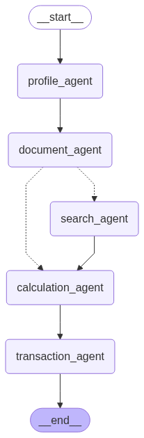

### Project Overview
This banking assistant system provides two main services:
1. **TFSA (Tax-Free Savings Account) Service** - Handles contributions, room calculations, and policy queries
2. **e-Transfer Service** - Manages transfer limit increases and eligibility checks

The system uses an MCP (Modular, Composable, Pluggable) architecture with:
- Separate MCP servers for each service
- Dedicated clients for each service
- Streamlit-based chat host for unified access

---

### File Notes

#### 1. tfsa_assistant.py
**Purpose**: Core TFSA contribution processing logic  
**Key Features**:
- Calculates contribution room based on historical rules
- Processes TFSA contributions
- Integrates with banking systems (mock implementation)
- Uses LangGraph for workflow management
- Visualizes workflow as Mermaid diagram



**Dependencies**:
- `langchain`, `langgraph`, `dotenv`

#### 2. tfsa_mcp_server.py
**Purpose**: Exposes TFSA services through MCP interface  
**Key Components**:
- Tools: `check_contribution_room`, `execute_contribution`
- Resources: `tfsa-advice`, `tfsa-annual://limit`
- Prompts: `explain_tfsa_rules`
- Handles TFSA policy queries and transactions

**Dependencies**:
- `mcp`, `tfsa_assistant`

#### 3. tfsa_mcp_client.py
**Purpose**: Client interface for TFSA MCP server  
**Key Features**:
- CLI interface for interacting with TFSA services
- Supports both interactive and command-line modes
- Lists available tools, resources, and prompts
- Executes TFSA-related operations

**Dependencies**:
- `mcp`, `langchain`, `langgraph`

#### 4. e_transfer_assistant.py
**Purpose**: Core e-Transfer limit processing logic  
**Key Features**:
- Checks eligibility for limit increases
- Processes limit adjustment requests
- Integrates with banking systems (mock implementation)
- Visualizes workflow as Mermaid diagram


**Dependencies**:
- `langchain`, `langgraph`, `dotenv`

#### 5. e_transfer_mcp_server.py
**Purpose**: Exposes e-Transfer services through MCP interface  
**Key Components**:
- Tools: `check_e_transfer_limit`, `increase_limit`
- Handles limit increase requests and eligibility checks

**Dependencies**:
- `mcp`, `e_transfer_assistant`

#### 6. e_transfer_mcp_client.py
**Purpose**: Client interface for e-Transfer MCP server  
**Key Features**:
- CLI interface for e-Transfer services
- Supports interactive and command-line modes
- Lists available tools and resources
- Executes limit-related operations

**Dependencies**:
- `mcp`, `langchain`, `langgraph`

#### 7. mcp_chat_host.py
**Purpose**: Unified chat interface for banking services  
**Key Features**:
- Streamlit-based web UI
- Intelligent routing between TFSA/e-Transfer services
- Displays invoked components (tools/resources/prompts)
- Shows service used for each response
- Maintains conversation history

**Key Improvements**:
- LLM-based query classification (handles misspellings)
- Robust output capture from MCP clients
- Complete component tracking
- Environment variable passthrough

**Dependencies**:
- `streamlit`, `langchain`, `dotenv`

---

### Installation and Setup
```bash
# Clone repository
git clone https://github.ibm.com/Jerry-Shao/agentic-ai-tfsa.git
cd banking-assistant

# Install dependencies
pip install -r requirements.txt

# Set up environment variables
cp .env.example .env
# Edit .env with your actual values
```

Note: to enable git push documents
```shell
git config http.postBuffer 524288000
git push
```

### Running the System
1. Start MCP servers (in separate terminals):
```bash
python tfsa_mcp_server.py
python e_transfer_mcp_server.py
```

#### Using the MCP Python SDK installation.
mcp version: Check the version
mcp run: Run the MCP server
mcp dev: Run the MCP server with MCP Inspector
mcp install: Connect the MCP server to Claude Desktop
```shell
pip install "mcp[cli]"
mcp run tfsa_mcp_server.py
mcp dev tfsa_mcp_server.py
# This command not install server well. Need to manually update configuration file claude_desktop_config.json
mcp install /PATH_TO_PROJECT/tsfa/tfsa_mcp_server.py --name "TFSA Assistant" -f /Users/jerryshao/Documents/docs/Software/AI/structured-language-extraction/.env
```
claude_desktop_config.json
```json
{
  "mcpServers": {
    "TFSA Assistant": {
      "command": "uv",
      "args": [
          "--directory",
          "/PATH_TO_PROJECT/tsfa",
          "run",
          "tfsa_mcp_server.py"
      ],
      "env": {
        "LOGGING_LEVEL": "DEBUG",
        "IBM_CLOUD_URL": "https://us-south.ml.cloud.ibm.com",
        "PROJECT_ID": "2e0bdaa6-5841-4992-af94-50132e6b10cc",
        "API_KEY": "1UGPkvU7CsoqVn3QwFSM43bQS-a1tYOrp2RafW9uxxxx",
        "OLLAMA_ENDPOINT_URL": "http://localhost:11434",
        "DEEPSEEK_API_KEY": "sk-8de4a6f3df3448d583009b6a97aexxxx",
        "DEEPSEEK_BASE_URL": "https://api.deepseek.com",
        "TAVILY_API_KEY": "tvly-h0npH0s2aSByVHeShBdQsXNML0vAxxxx"
      }
    },
    "e-transfer Assistant": {
      "command": "uv",
      "args": [
          "--directory",
          "/PATH_TO_PROJECT/tsfa",
          "run",
          "e_transfer_mcp_server.py"
      ],
      "env": {
        "LOGGING_LEVEL": "DEBUG",
        "IBM_CLOUD_URL": "https://us-south.ml.cloud.ibm.com",
        "PROJECT_ID": "2e0bdaa6-5841-4992-af94-50132e6b10cc",
        "API_KEY": "1UGPkvU7CsoqVn3QwFSM43bQS-a1tYOrp2RafW9uxxxx",
        "OLLAMA_ENDPOINT_URL": "http://localhost:11434",
        "DEEPSEEK_API_KEY": "sk-8de4a6f3df3448d583009b6a97aexxxx",
        "DEEPSEEK_BASE_URL": "https://api.deepseek.com",
        "TAVILY_API_KEY": "tvly-h0npH0s2aSByVHeShBdQsXNML0vAxxxx"
      }
    } 
  }
}
```

#### Using FastMCP installation.
```shell
pip install fastmcp
python tfsa_mcp_server.py
```

2. Run the MCP chat host:
```bash
# For better performance, install the Watchdog module:
xcode-select --install
pip install watchdog
streamlit run mcp_chat_host.py
```

3. Testing Flow for Google OAuth SSO
    1. Access https://localhost:5000/login or https://localhost:5000/protected
    2. Authenticate with Google
    3. Redirected to /protected with user info
    4. Check MCP integration logic

### System Architecture
MCP transforms brittle AI systems into flexible, enterprise-ready agent ecosystems by standardizing interactions between reasoning (client), orchestration (host), and capabilities (servers).

```
User → mcp_chat_host.py (Streamlit UI)
       ├──→ tfsa_mcp_client.py → tfsa_mcp_server.py → tfsa_assistant.py
       └──→ e_transfer_mcp_client.py → e_transfer_mcp_server.py → e_transfer_assistant.py
```
#### **Core Roles in MCP Architecture**
1. **Host**  
   - **Role**: Central orchestrator and root environment.  
   - **Responsibilities**:  
     - Manages agent lifecycles, user sessions, and security (authentication, sandboxing).  
     - Maintains a capability registry of available tools/servers.  
     - Enables dynamic tool discovery/hot-swapping (plug-and-play extensibility).  
     - Bridges user interfaces (e.g., desktop apps, web portals) with agents.  
   - **Key Feature**: Supports multi-agent orchestration (e.g., teams of specialized agents).

2. **Client**  
   - **Role**: Agent's gateway to external tools (1:1 connection with a server).  
   - **Responsibilities**:  
     - Decomposes tasks, performs reasoning/planning.  
     - Handles MCP protocol (JSON-RPC 2.0) for tool invocation.  
     - Manages session context (memory, error recovery, workflow sequencing).  
     - Enforces security policies and logs actions for observability.  
   - **Note**: May embed the core "brain" (LLM/planner) or act as a protocol adapter.

3. **Server**  
   - **Role**: Modular, stateless provider of capabilities.  
   - **Capability Types**:  
     - **Resources**: Read-only data access (e.g., database queries, file retrieval).  
     - **Tools**: Action-oriented functions (e.g., send email, run calculations).  
     - **Prompts**: Predefined templates/workflow scripts (e.g., report generation).  
   - **Design**: Self-contained, interoperable, and dynamically discoverable.  

---

#### **Interaction Workflow**
1. **Initialization**:  
   - Host spins up agents and registers available servers.  
   - Client discovers server capabilities via standardized schemas.  

2. **Execution** (e.g., user request: *"Schedule meeting + email team"*):  
   - Client decomposes tasks → Invokes relevant servers (e.g., `Calendar.getAvailabilities`).  
   - Servers execute actions (e.g., `Email.sendInvite`) and return structured responses/errors.  
   - Client synthesizes results → Host delivers output to user.  

3. **Protocol**:  
   - Uses **JSON-RPC 2.0** for requests/responses (method calls, parameters, error handling).  
   - Supports local (stdin/stdout, sockets) and remote (HTTP/WebSockets) communication.  

---

#### **Pillars of MCP Architecture**
1. **Modular**  
   - Components (LLMs, tools, memory) are decoupled and independently updatable.  
   - Servers can be added/removed at runtime without system-wide changes.  

2. **Composable**  
   - Tools/resources combine like "Lego blocks" for dynamic workflows (e.g., fetch data → analyze → visualize).  
   - Enables reuse across contexts (e.g., email server for scheduling and bug alerts).  

3. **Programmable**  
   - Transparent, scriptable agent behaviors (chain-of-thought, error handling).  
   - Supports debugging, auditing, and future agent self-enhancement.  

---

#### **Key Advantages**
- **Scalability**: Add/remove tools or agents without redeployment.  
- **Security**: Centralized auth, sandboxing, and protocol-level encryption (HTTPS/TLS).  
- **Resilience**: Error recovery and adaptive workflows (e.g., fallback time slots).  
- **Extensibility**: Hot-swap servers (e.g., replace a calendar provider with zero code changes).  

---

#### **Real-World Impact**
- **Before MCP**: Hardcoded integrations required manual updates for scaling/errors.  
- **After MCP**:  
  - Database scaling: Simply register a new server → agents auto-discover it.  
  - Office assistant (e.g., "Ava"): Combines calendar, email, and booking tools dynamically.  
  - Developer efficiency: Focus on capability-building vs. integration glue code.  


### Key Features
- **Intelligent Routing**: Uses LLM to classify queries to correct service
- **Component Tracking**: Shows exact tools/resources used for each response
- **Multi-process Architecture**: Isolates services for reliability
- **Visual Workflows**: Generates Mermaid diagrams of agent workflows
- **Unified Interface**: Single chat UI for all banking services

### Troubleshooting
- Ensure all servers are running before starting chat host
- Verify environment variables are properly set
- Check terminal outputs for each component
- For misspellings, the LLM classifier automatically corrects common errors (e.g., "TSFA" → "TFSA")
