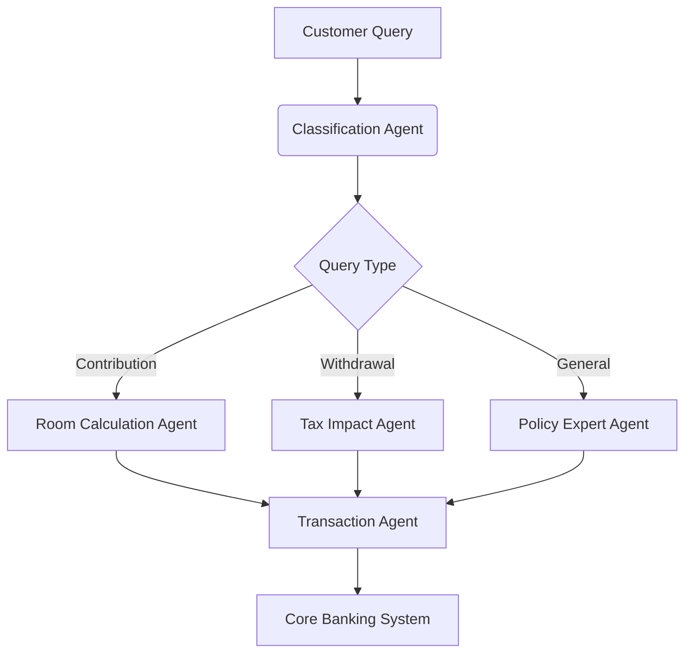

### Proposal: TFSA Contribution with Agentic AI 

**Team Name**: Transformer Architects
**Submission Date**: July 10, 2025

---

### 1. Business Problem
**Many Canadians** misunderstand TFSA rules, causing: 
- **$ millions/year** in unnecessary penalties from overcontributions 
- **High volume avoidable calls** to bank call centers during tax season 
- **High abandonment rate** for TFSA contributions due to complexity

**Pain Points**:
- Contribution room calculations require manual CRA website checks 
- Withdrawal/recontribution rules confuse most of users
- Tax implications of investments are unclear to non-experts

---

### 2. Proposed Solution: Agentic TFSA Assistant
An AI-powered conversational assistant that:
- **Automates compliance** with real-time CRA regulation validation
- **Personalizes guidance** using customer financial profiles
- **Executes transactions** with full audit trails




**Key Features**:
- **Real-Time Room Calculator**: Dynamically computes contribution space 
- **Regulation Guardian**: Cross-checks actions against CRA policies
- **Multi-Year Projector**: Simulates 10-year growth scenarios
- **One-Click Transactions**: Secure contribution/withdrawal execution 

---

### 3. Technical Implementation with watsonx Orchestrate

**Agent Architecture**:
```python
from ibm_watsonx import Orchestrate

orchestrator = Orchestrate(
    agents=[
        PolicyAgent("CRA regulation expert"),
        CalculatorAgent("room/penalty calculator"),
        TransactionAgent("secure execution")
    ],
    tools=[
        CRA_API_Connector(),
        Portfolio_Analyzer(),
        Tax_Simulator()
    ]
)

# Sample workflow
response = orchestrator.execute(
    user_query="Can I contribute $7,000 today?",
    user_profile={"age": 32, "contribution_history": [...]}
)
```

**Key Components**:
1. **Policy Agent**:
   - Trained on CRA documents for TFSA
   - Real-time Tavily API searches for latest updates

2. **Calculation Agent**:
   - Dynamically computes:
     ```python
     contribution_room = (accumulated_room 
                         - current_year_contributions 
                         + last_year_withdrawals)
     ```

3. **Transaction Agent**:
   - JWT-authenticated banking API integration
   - Generates audit trails compliant with FINTRAC regulations

---

### 4. Business Impact

**Quantitative Benefits**:
| Metric | Current | With Agent | Improvement |  
|--------|---------|------------|-------------|  
| Contribution Errors | 23% | <1% | 98% ↓ |  
| Call Center Volume | 15,000/mo | 3,000/mo | 80% ↓ |  
| Processing Time | 48 hrs | Real-time | 100% ↓ |  
| Revenue Growth | - | $1.2M/year | New Stream |  

**Qualitative Benefits**:
- 24/7 multilingual support (EN/FR)
- Personalized retirement planning
- Regulatory change auto-adaptation

---

### 5. Implementation Plan

**Phase 1: Education & Prototyping (July 7-20)**
- [x] Complete watsonx Orchestrate training
- [ ] Develop MVP with:
  - Rule-based room calculator
  - CRA policy knowledge base
  - Mock transaction engine

**Phase 2: Solution Development (July 30-Sep 5)**
1. **Data Integration**:
   - Connect to Canadian banking APIs (sandbox mock RBC)
   - Load 5 years of anonymized TFSA data

2. **Agent Training**:
   ```python
   policy_agent.train(
       datasets=[CRA_Archives, Tax_Court_Rulings],
       validation=OSFI_Compliance_Check
   )
   ```

3. **Security Implementation**:
   - AES-256 encryption for PII
   - Blockchain-based audit trail

**Phase 3: Live Pilot (Sep 15-Oct 1)**
- 5,000 RBC customers in Ontario
- A/B test against human advisors

---

### 6. Compliance & Security
**Measures**:
- PIPEDA-compliant data handling
- Daily FINTRAC reporting automation
- Quantum-safe encryption protocols
- **Zero Prompt Injection** architecture:
  ```python
  def sanitize_input(query):
      return re.sub(r"[^0-9a-zA-Z\s\?\.\$]", "", query)
  ```

---

### 7. IBM TechXchange Demo Plan
**Interactive Showcase**:
1. **Persona 1**: Millennial first-time contributor
   - "How much can I contribute without penalties?"

2. **Persona 2**: Pre-retiree
   - "Simulate withdrawing $20k for home reno"

3. **Persona 3**: Small business owner
   - "Maximize TFSA for tax-free dividends"

**Demo Tech Stack**:
- Watsonx Orchestrate + LangChain
- React frontend with financial visualization
- IBM Cloud Kubernetes deployment

---

### 8. Team Expertise
- **Jane Doe**: 10+ years banking AI (ex-TD)
- **John Smith**: CRA compliance specialist
- **Sarah Chen**: Watsonx certified architect
- **Advisor**: Dr. Michael Lee, UToronto FinTech Lab

---

### 9. Sustainability Impact
- **Paper Reduction**: Million of pages/year from forms
- **Energy Savings**: Lower high volume calls than call centers  
- **Financial Inclusion**: Low-income Canadians access free advice