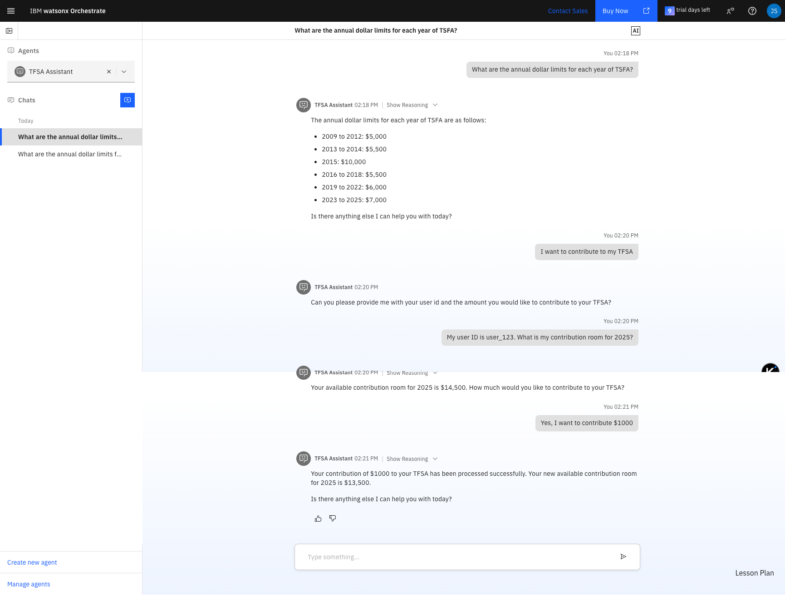

## ✅ Steps – watsonx Orchestrate

1. Installation
   * Prerequisites
     * **Python**: The programming language that the ADK is written in. The ADK requires at least Python 3.11, and the latest compatible version is Python 3.13. For more information, see [Python](https://www.python.org/downloads/).
     * **Pip**: Pip is Python’s package manager. In some operating systems, it’s included with Python’s installation. For more information, see [Pip](https://pip.pypa.io/en/stable/installation/).
     * Create and activate a virtual environment with venv to install the ADK. For more information, see [venv - Creation of virtual environments](https://docs.python.org/3/library/venv.html).
   * Installing the ADK

     On your local computer open your Terminal / Command Prompt and run the following commands:
     1. For Mac users, install the ADK with pip:
     ```shell
     pip install ibm-watsonx-orchestrate langchain-ibm
     ```
     2. For Windows users, you will need to setup a Windows Subsystem for Linux environment. Open PowerShell then run following:
     ```shell
     wsl --install
     sudo apt-get update
     sudo apt install python3-full
     sudo python3 -m venv venv
     source venv/bin/activate
     pip3 install ibm-watsonx-orchestrate
     sudo apt install net-tools
     ```
     3. Check watsonx Orchestrate CLI version
     ```shell
     orchestrate --version
     ```
     After installation, you can start using the ADK and its CLI. For more information on available commands and arguments, use the --help argument at the end of a command. For example: orchestrate --help.
   * Installing dependencies   
   ```shell
   pip install -r requirements.txt
   ```
   
2. Setup remote watsonx Orchestrate

   In order to publish and deploy your agents and tools in this lab you need to connect to your watsonx Orchestrate environment. To do that you will need two credentials: your instance URL and your IBM cloud API key.
   1. Create and download your API key & get the watsonx Orchestrate instance URL
      1. [Log in](https://www.ibm.com/docs/en/watsonx/watson-orchestrate/current?topic=orchestrate-logging-in-watsonx) to your watsonx Orchestrate account.
      2. Click your user profile and open the **Settings** page.
      3. Open the **API details** tab and click **Generate API key**.
      4. Copy your Service Instance URL:
      ```html
      https://api.<region>.watson-orchestrate.ibm.com/instances/<wxo_instance_id>
      ```
      5. Create a .env file with the following contents:
      ```properties
      WO_DEVELOPER_EDITION_SOURCE=orchestrate
      WO_INSTANCE=<service_instance_url>
      WO_API_KEY=<wxo_api_key>
      ```
      Replace <service_instance_url>, <wxo_api_key>, <your_wxo_email>, and <your_wxo_password> with the appropriate information.

   2. Activate a remote watsonx Orchestrate environment
   
   To activate/update a remote the watsonx Orchestrate environment with the ADK, run the following command in the CLI:
   ```shell
   orchestrate env add -n "watsonx-challenge" -u "$WO_INSTANCE" --type ibm_iam --activate
   ```
   To make sure the orchestrate environment has been successfully created and activated you can run orchestrate env list.
   ```shell
   orchestrate env list
   ```
   You can list all LLMs installed in your watsonx Orchestrate environment:
   ```shell
   orchestrate models list
   ```

3. Deployment with the `deploy.sh` Script

   A `deploy.sh` script is provided to automate the setup, import, deployment, and cleanup of your Orchestrate environment.

   **Key Features of the Deployment Script:**
   *   **Dynamic Agent Discovery**: The script automatically scans the `agents/` directory for all `*.yaml` files. You no longer need to manually edit the script to add or remove agents.
   *   **Dependency-Aware Deployment**: It analyzes dependencies between agents by checking for a `collaborators` field in the YAML files. This ensures that base agents are imported and deployed *before* the agents that depend on them. Cleanup is performed in the correct reverse order.

   #### Script Usage

   1.  **Make the script executable:**
       ```shell
       chmod +x deploy.sh
       ```

   2.  **Run the full setup (Recommended):**
       This command runs all steps: sets up the environment, imports tools, and then imports and deploys all agents in the correct dependency order.
       ```shell
       ./deploy.sh
       ```

   3.  **Run specific functions:**
       You can also run individual functions for more granular control.

       *   **Import Agents**: Imports all agents from the `agents` directory in dependency order.
           ```shell
           ./deploy.sh import_agents
           ```

       *   **Deploy Agents**: Deploys all previously imported agents in dependency order.
           ```shell
           ./deploy.sh deploy_agents
           ```

       *   **Undeploy Agents**: Undeploys all agents in reverse dependency order.
           ```shell
           ./deploy.sh undeploy_agents
           ```

       *   **Remove Agents**: Removes all agents from Orchestrate in reverse dependency order.
           ```shell
           ./deploy.sh remove_agents
           ```

       *   **Cleanup Resources**: Undeploys and removes all agents. Note: This does *not* remove the tools or the environment itself.
           ```shell
           ./deploy.sh cleanup_resources
           ```

       For a full list of available functions, run `./deploy.sh --help`.

4. Test in the watsonx Orchestrate chat UI

   After running the deployment script, the agents will be available in the watsonx Orchestrate chat UI.
   
   Test FAQs
   ```text
   What are the annual dollar limits for each year of TSFA?
   What are the annual dollar limits for each year of TSFA including 2025?
   What are the overcontribution penalty policies?
   What are withdrawal rules?
   I want to contribute to my TFSA
   My user ID is user_123. What is my contribution room for 2025?
   Yes, I want to contribute $2000
   ```

5. Testing
