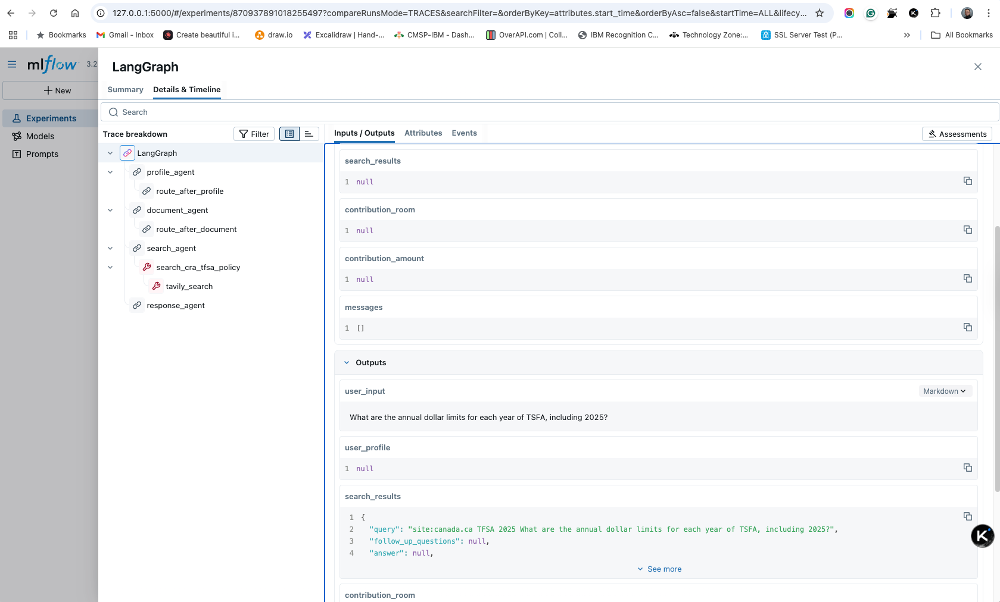
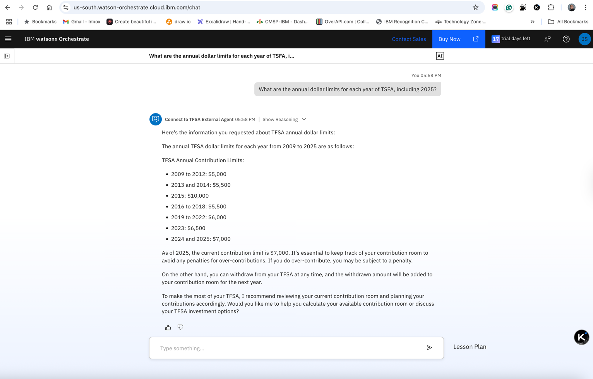
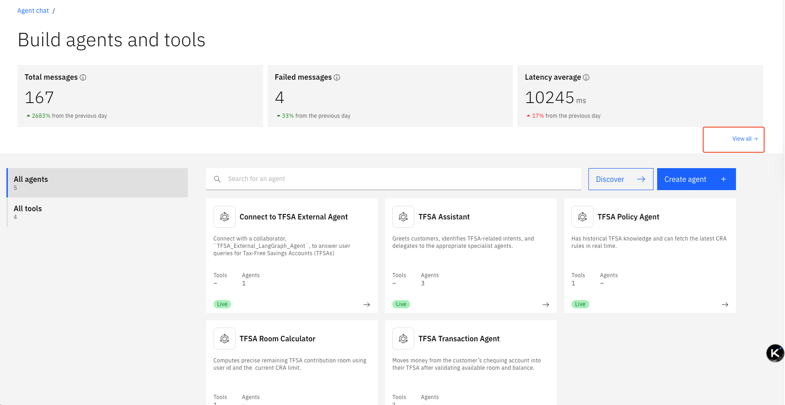
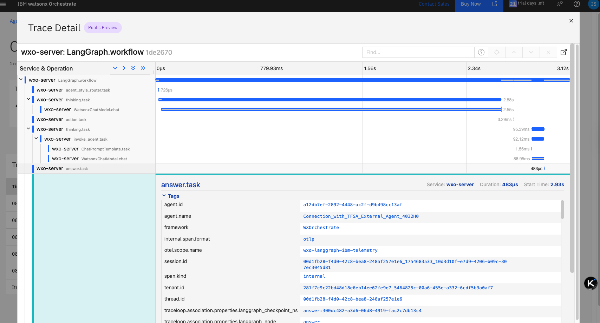
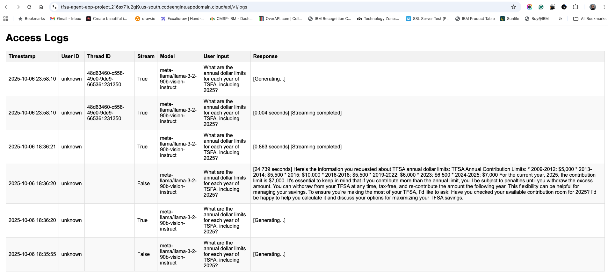
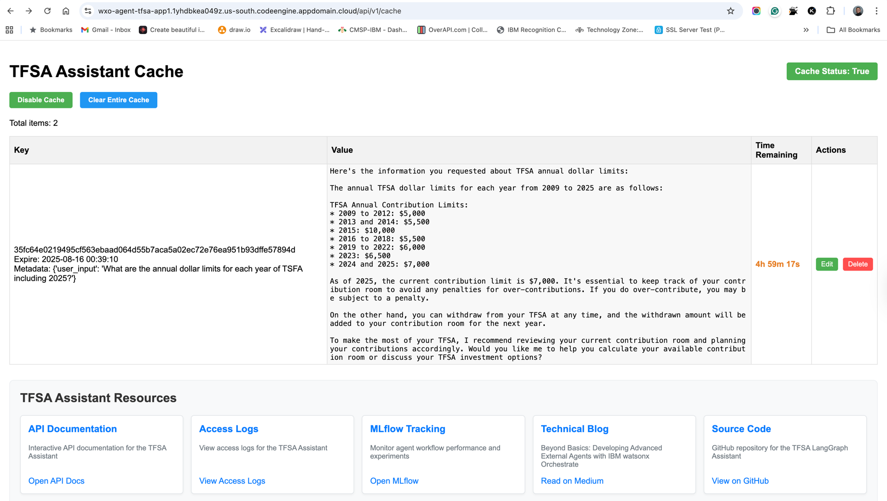

# IBM Watsonx Orchestrate - External Agent for TFSA

For examples of IBM watsonx Orchestrate external agent development, refer to the [IBM watsonx Orchestrate Developer Toolkit - External Agent](https://github.com/watson-developer-cloud/watsonx-orchestrate-developer-toolkit).

For official feature documentation, refer to the [IBM Developer API Catalog](https://developer.ibm.com/apis/catalog/watsonorchestrate--custom-assistants/api/API--watsonorchestrate--ibm-watsonx-orchestrate-api#Register_an_external_chat_completions_agent__agents_external_chat_post).

For official watsonx Orchestrate Agent Development Kit (ADK) documentation, refer to the [Creating Agents -> provider: external_chat](https://developer.watson-orchestrate.ibm.com/agents/build_agent#provider%3A-external-chat).

## Overview

This TFSA implementation demonstrates how to deploy an external agent as a serverless application in IBM Cloud. The application leverages 
[FastAPI](https://fastapi.tiangolo.com) and [LangGraph](https://www.langchain.com/langgraph) to create a chat completion service that integrates with Ollama, Deepseek, IBM watsonx and OpenAI models. It also includes AI tool for TFSA policy search using [Tavily API](https://www.tavily.com).

The API is designed to be used with IBM watsonx Orchestrate, but can be used independently as well. It must follow the [OpenAI-compatible OpenAPI specification](../spec.yaml). Endpoints **honour `X-IBM-THREAD-ID`** for multi-turn conversations, **stream via SSE** when `stream=true`. Both stream and non-stream must be implemented.

## Features

- **Chat Completion Service**: The application provides a RESTful API endpoint for chat completions, supporting both synchronous and streaming responses following the specification of IBM Orchestrate external agents.
- **Integration with AI Models**: It provides an example that supports multiple AI models, including local Ollama, Deepseek, IBM's watsonx and OpenAI's GPT, allowing for flexible AI-driven interactions.
- **Tool Integration**: The application includes tool for TFSA policy search using [Tavily API](https://www.tavily.com), which can be invoked during chat interactions.
- **Token Management**: Implements a caching mechanism for IBM Cloud IAM tokens to optimize authentication processes.
- **Logging and Debugging**: Logging is set up to facilitate debugging and monitoring of the application.

Note:
- In `app.py` that defines the `FastAPI` app object, `selected_tools = [chat_tfsa_assistant]` in the `chat_completions` function to enable the tool. Please make sure to update this line to match your tool configuration. the function `chat_completions`. You can choose any Python function for the tool.
- Multiple tools can be added to the `chat_completions` function through `selected_tools`. It relays on calling `create_react_agent` to create an agent graph that calls tools in a loop until a stopping condition is met. This is a simple workflow that treat tools as conections. In the real complex business senarios, you may want to use a more sophisticated workflow.
- `app.py` defines a `chat_completions` function that takes a `request` object as input and returns a `response` object.
- We optimize tools calling to optimize performance: if there were one tool in the selected list `selected_tools`, we can directly call the tool to get the result. In testing, it will save 8 to 10 seconds for each tool call.

## Security Limitations

Please be aware that this example accepts any API Key or Bearer token for authentication. 
It is recommended to implement your own authentication security measures to ensure proper security.

## Deployment Instructions

### Step 1: Create a Code Engine Project

1. **Using IBM Cloud Web UI:**
   - Navigate to [IBM Cloud Code Engine Projects](https://cloud.ibm.com/containers/serverless/projects) and select **Create**. Name your project, for instance `wxo-agent-test1`.
   - Or if project is created, copt the project name `ce-itz-wxo-688a2b3ac1fc751be4edfa`
   - Select the agent you created (`ce-itz-wxo-688a2b3ac1fc751be4edfa`) and choose the **Application** menu item from the left navigation panel.

2. **Create an API Key for Registry Secret:**
   - Select **Manage** from the title bar menu and go to **Access (IAM)**.
   - From the left navigation menu, select **API keys**.
   - Click **Create** and copy the new API key for use in the registry secret.

     3. **Create the Code Engine Application:**
        - Click the **Create** button to start creating an application.
        - Create from source code
          - Under **Code**, select **Build container image from source code**.
          - In the **Code repo URL** field, enter `https://github.com/jerryshao2012/agentic-ai-tfsa`.
          - Click **Specify build details**:
            - **SSH secret:** None
            - **Branch name:** main
            - **Context directory:** `wxo_adk_external_agent/langgraph_python`
            - Click **Next**
            - **Dockerfile:** Dockerfile (leave default)
            - Click **Next**
            - Under **Registry secret**, create a secret (if one doesn't exist) using the **API Key** created above
          - **Application name:** Any name, for instance `wxo-agent-tfsa-app1`
          - **Domain mappings:** Public
          
          Note: if you get an error "Failed to create namespace: You are not authorized to access the IBM Container Registry in this account", try `podman` command to build image locally and then push to repository. Thanks [@Chung Zheng](mailto:Chung.Zheng@ibm.com) provided the solution.

            ```shell
            brew install podman
            podman machine init
            podman machine start
            # Use #username iamapikey, #pwd <WATSONX_API_KEY> to login
            podman login us.icr.io
            cd wxo_adk_external_agent/langgraph_python
            podman build . -t tfsa-agent-app --platform linux/amd64
            podman tag localhost/tfsa-agent-app us.icr.io/cr-itz-4yv6abja/tfsa-agent-app:latest
            podman push us.icr.io/cr-itz-4yv6abja/tfsa-agent-app:latest
            ```
        - Create from image
          - Under **Code**, select **Use an existing container image**.
          - In the **Image reference** field, enter `private.us.icr.io/cr-itz-4yv6abja/tfsa-agent-app`.

4. **Set Environment Variables:**
   - Add the following environment variables:
     - `LOGGING_LEVEL`
     - `AI_SERVICES_PROVIDER`
     - `WATSONX_SPACE_ID` or `WATSONX_PROJECT_ID`
     - `WATSONX_API_KEY`
     - `WATSONX_URL`
     - `TAVILY_API_KEY`
     - `DEEPSEEK_API_KEY` (only needed if you plan to use deepseek models)
     - `OPENAI_API_KEY` (only needed if you plan to use OpenAI models)
   - Select the `Create` button

5. **Test the Application:**
   - Choose **Test application** and click **Application URL**.
     - It is expected this page will not be found, we need to slightly update the path
     - Append `/docs` to the end of the URL path to view a formatted API page.
       - Example: `https://wxo-agent-tfsa-app1.1yhdbkea049z.us-south.codeengine.appdomain.cloud/docs`
         - Test API:
           - Sync test
           ```shell
            curl -X 'POST' \
              'https://wxo-agent-tfsa-app1.1yhdbkea049z.us-south.codeengine.appdomain.cloud/chat/completions' \
              -H 'accept: application/json' \
              -H 'Authorization: Bearer xxx' \
              -H 'Content-Type: application/json' \
              -d '{
              "model": "meta-llama/llama-3-2-90b-vision-instruct",
              "messages": [
                {
                  "role": "user",
                  "content": "What are the annual dollar limits for each year of TSFA, including 2025?"
                }
              ],
              "stream": false
            }'
           ```
           - Streaming test
           ```shell
             curl -X 'POST' \
              'https://wxo-agent-tfsa-app1.1yhdbkea049z.us-south.codeengine.appdomain.cloud/chat/completions' \
              -H 'accept: application/json' \
              -H 'Authorization: Bearer xxx' \
              -H 'Content-Type: application/json' \
              -d '{
              "model": "meta-llama/llama-3-2-90b-vision-instruct",
              "messages": [
                {
                  "role": "user",
                  "content": "What are the annual dollar limits for each year of TSFA, including 2025?"
                }
              ],
              "stream": true
            }'
           ```
   - [MLflow Tracing](https://mlflow.org/docs/latest/genai/tracing/) provides automatic tracing capability for LangGraph, as a extension of its LangChain integration. By enabling auto-tracing for LangChain by calling the `mlflow.langchain.autolog()` function, MLflow will automatically capture the graph execution into a trace and log it to the active MLflow Experiment.
     1. Install the mlflow package
       ```shell
        pip install mlflow
       ```
     2. Launch the MLflow server
       ```shell
        mlflow ui
       ```
     3. Run `tfsa_assistant_mlflow_test.py`:
       ```shell
        python tfsa_assistant_mlflow_test.py
       ```
       
     
### Step 2: Deploy tools linked with the External Agent

1. Import external agents
Update `api_url` as needed in `tfsa_langgraph_external_agent.yaml`.
- Example: `https://wxo-agent-tfsa-app1.1yhdbkea049z.us-south.codeengine.appdomain.cloud/chat/completions`
```shell
orchestrate agents import -f tfsa_langgraph_external_agent.yaml
```

2. Import agents
```shell
orchestrate agents import -f connection_with_tfsa_external_agent.yaml
```

3. Deploy agents in watsonx Orchestrate UI

### Step 3: Call the new External Agent from Orchestrate

1. **In IBM watsonx orchestrate Web UI:**
   - From the top left hamburger menu, select **Chat** from the left-hand navigation.
   - In the dropdown box, select `Connect to TFSA External Agent`
   - Type a question that should route to the new agent, like `What are the annual dollar limits for each year of TSFA, including 2025?`
   - The results from the external agent should be streamed to the IBM watsonx Orchestrate chat window



Test FAQs
```text
What are the annual dollar limits for each year of TSFA?
What are the annual dollar limits for each year of TSFA, including 2025?
What are the overcontribution penalty policies?
What are withdrawal rules?
I want to contribute to my TFSA
My user ID is user_123. What is my contribution room for 2025?
Yes, I want to contribute $2000
```

2. To check agent communication logs
    - From Chat UI, select **Manage agents**
    - Click right side button named **View all**
   
    - Click **Connect to TFSA External Agent**
   

3. Enhaced agentic communication cache and logs
    - To check agent access request logs from watsonx Orchestrate: https://wxo-agent-tfsa-app1.1yhdbkea049z.us-south.codeengine.appdomain.cloud/logs
   
    - To manage agentic communication cache: https://wxo-agent-tfsa-app1.1yhdbkea049z.us-south.codeengine.appdomain.cloud/cache
   

Note:
- One issue we are facing in the testing that the external agent calling may take a long time to respond. The configuraion of the external agent call can not be defined in the agent.yaml file. In this sample, we use a self-expired `cache` to cache the external agent call result. This is a workaround to avoid the long waiting time. In production, we should use a persistent distributed `cache` to go around it. ALso only the policy type user inqueries are cached. 